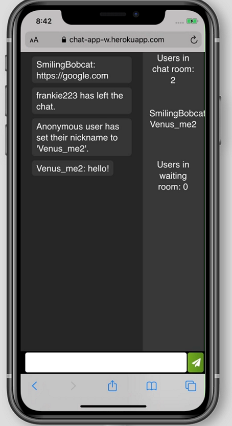

# Chat Client

Chat client featuring multiple simultaneous connections through web sockets. Allows users to create nicknames and post messages to each other and displays how many users are present in a current session. 

## [Demo the application](https://chat-app-w.herokuapp.com/)




## Getting Started
The following instructions will allow you to clone the project to your machine for testing.

### Installing 

Git clone to your local machine:

```
https://github.com/wgbcamp/Chat-Client.git
```

### Running Application

cd into the directory that you cloned the application to and install dependencies with:

```
npm install
```

Set up SQL file with database of your choice.

Start development environment with:

```
npm run start
```

## Technologies 

* Javascript, CSS, HTML
* Socket.IO
* jQuery
* Express.js
* Node.js
* NPM
* mySQL
